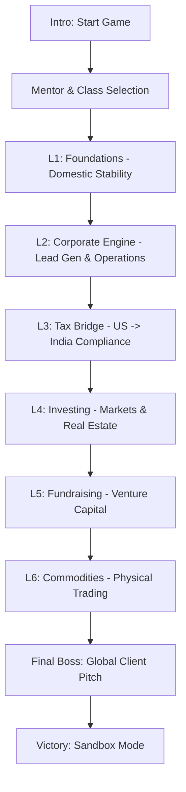

# 🏦 THE GLOBAL LEDGER: Financial RPG

> **Real-Life RPG. From India to the US Market. Level up from Novice to Global Financial Architect.**

---

## 🎮 Overview

**The Global Ledger** is an immersive, high-stakes financial RPG built to teach the complex mechanics of international business, cross-border taxation, and wealth building. Unlike traditional financial simulators, it blends **RPG elements** (XP, Skills, Boss Battles) with **real-world financial logic** (W-8BEN forms, 44ADA presumptive tax, Forex fluctuations, and CIBIL/FICO credit scores).

### Core Mechanics
- **Stress Meter**: Your physical/mental health impacts energy recharge and decision-making.
- **Credit Score**: Dynamic score that dictates your access to leverage and funding.
- **Forex Ticker**: Real-time USD/INR fluctuation affecting your global profit margins.
- **AI Mentors**: Context-aware feedback from "Wall St. Shark", "Zen Monk", or "Gamer Bro".

---

## 🗺️ The Path to Mastery

---

## 📦 Level Breakdowns

### 🏠 Level 1: Foundations
*Focus: Survival & Stability*
- **Gross vs Net**: Learn the "Salary Illusion" and tax regimes.
- **Lifestyle Creep**: Watch your expenses automatically rise with promotions.
- **Emergency Events**: Handle the "Indian Wedding" invite—social credit vs. financial fire.
- **FIRE Math**: Track your years to freedom based on current savings.

### ⚙️ Level 2: Corporate Engine
*Focus: Operations & Client Mastery*
- **Lead Generation**: Rotate between Cold Emails, Paid Ads, and Networking.
- **AI Negotiation**: Battle a custom LLM to secure high-value contracts.
- **The Doormat Effect**: Accepting too much free work turns clients into Micromanagers.
- **Staffing**: Hire Junior vs. Senior devs; manage burn rates and staff poaching.

### ⚖️ Level 3: Tax Bridge
*Focus: International Compliance*
- **Treaty Shielding**: Validate W-8BEN forms to slash US withholding from 30% to 15%.
- **Tax Hacks**: Deploy 44ADA (Presumptive Tax) and HUF (Family Trust) structures.
- **The POEM Trap**: Manage your management location to avoid double taxation.
- **Audit Boss**: Survive a Year 3 fiscal audit where undeclared assets lead to seizure.

---

## 🛠️ Technical Stack

- **Frontend**: React 19 (Hooks/Context)
- **Styling**: Tailwind CSS + Lucide Icons
- **Visuals**: Recharts for dynamic financial projections
- **AI Engine**: Google Gemini Pro integration for:
    - Contract Analysis
    - Contextual Mentor Feedback
    - Scope Creep & Upsell Scenarios
- **State Management**: LocalStorage-backed `PlayerState` for persistent progression.

---

## 🚀 Getting Started

1. **Clone the repository**
2. **Install dependencies**: `npm install`
3. **Set your API Key**: Add your `GEMINI_API_KEY` to `.env.local`.
4. **Launch**: `npm run dev`

---

## 📜 Educational Disclaimer

*The Global Ledger is an educational game. While it uses real-world rules and tax codes as inspiration, it is NOT formal financial or legal advice. Always consult with a qualified professional (CA/CPA) for actual business operations.*
